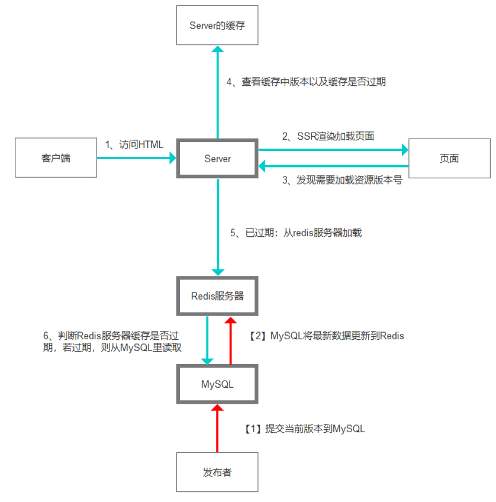
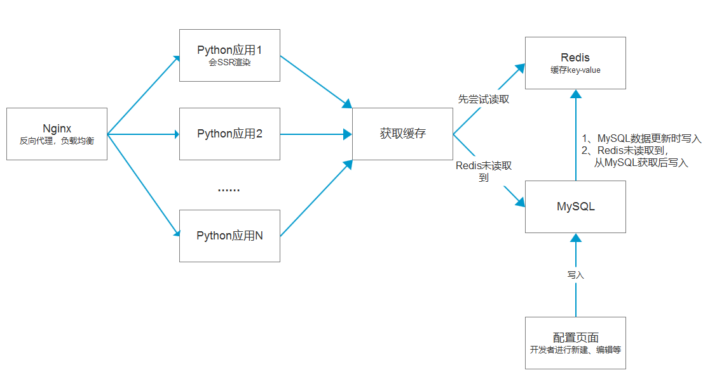

# 前端架构详谈（1）纯前端发布

* 0、前言
* 1、项目简述
* 2、场景描述
* 3、数据结构简述
* 4、项目核心点
* 5、后台服务
* 6、项目架构图
* 7、数据库设计
* 8、后期功能扩展
* 9、示例效果
* 10、总结

## 0、前言

在上一篇文章<a href='https://juejin.im/post/5cea1f705188250640005472'>《大型项目前端架构浅谈》</a>里，我简单的阐述了一下在大型项目里，前端架构如何设计。

有很多同学反映，说谈的比较浅。但由于篇幅所限，尽管已经写了8000字，但想每个都深入下去，实在是不太可能。

因此便有了这个续篇。

我考虑了一下，续篇的第一文，将优先深入阐述【2.4、纯前端版本发布】这一小结。

原内容如下：

```
2.4、纯前端版本发布
纯前端版本发布分为两步：

* 前端发布到生产环境——此时可以通过外网链接加正确的版本号访问到新版本的代码，但页面上的资源还是旧版本；

* 前端通过配置工具（或者是直接更新html文件），将html中引入的资源，改为新版本。   

解决的问题是：当前端需要发布新版本时，可以不依赖于后端（根据实际情况，也可以不依赖于运维）。毕竟有很多需求并不需要后端介入，单纯改个前端版本后就要后端发布一次，显然是一件非常麻烦的事情。

这个需要专门的工具，用于配置版本发布，我最近就在写这个。

意义：

提高发布效率，降低发布带来的人员时间损耗（这些都是钱），也可以在前端版本回滚的时候，速度更快。
```

## 1、项目简述

当前常见场景为：前端的版本，写死在后端渲染的页面中（或者写死在html静态页面中）。

这带来一个问题，当前端需要发布版本时，要么重新发布静态页面（依赖使用静态页面），要么需要后端来发布。

* 前者不利于后端使用页面渲染相关的中间件，比如 csrf 处理中，有一种方法就需要将 csrf-token 写入到页面中，又或者是国际化，将国际化内容直接写入到页面里；
* 后者显而易见，后端发布是一件很麻烦的事情；

<br/>
因此，我们期望实际场景中是这样一个形式（如下图）：



通过实现这样的流程，后端开发者可以在页面里订阅资源的版本号，并将其值写入页面进行渲染。

而前端开发者可以实现：

* 独立发布（通过管理页面提交最新的版本号，一次配置后无需依赖后端）；
* 提高前后端分离程度和可配置化能力；
* 遇见前端bug时，通过在线快速发布新版本或回滚到旧版本来修复bug的能力；


## 2、场景描述

在前端领域中，常见的<b>前端资源命名</b>，有三种方式：

1. 名字不变：如/js/app.js
2. hash名，每次发布是新的hash：如/js/app.r324wf1.js
3. 带版本号的名字：如/0.1.0/js/app.js

<br/>
<b>前端发布资源</b>时，也有两种方式：

1. html完全由前端管理，前端发布的时候会有html文件，webpack打包时自动在html里写文件名；
2. html由后端管理（服务器渲染），前端只负责发布js、css等资源文件。在前端发布之后，后端修改版本号再发布；


目前比较好的解决方案是 <b>第三种命名方式</b> 和 <b>第二种发布方式</b>，优点：

1. 版本管理清楚明确；
2. 版本发布后，当前分支自动锁死（不可修改），避免覆盖发布导致的bug；
3. 后端控制视图（html）能实现的功能更强（比如通过中间件在所有view里插入一些内容）； 

<b>实际场景对比：</b>

【常规方式】

1. 假如html后端管理，html上有一个js资源加载，链接为：<script src="//www.baidu.com/1.1.10/main.js"></script>
2. 发布后，发现1.1.10版本的前端页面存在一个bug，于是快速修复，发布1.1.11版本；
3. 如果需要修复这个bug，那么需要后端开发将html里的 1.1.10 修改为 1.1.11，然后再发布一次版本。缺点是后端发布毫无疑问是很麻烦的一件事情。

<br/>
【应用本项目后的解决方案】

1. 配置key-value系统，key为version，value默认配置为1.1.10，html的资源加载写为：<script src="//www.baidu.com/{{version}}/main.js"></script>
2. 第二步不变，前端发布修复了bug的1.1.11版本；
3. 在系统里更新配置，将key=version的value，更新为1.1.11；
4. 后端开发不需要做任何工作，Server在请求时，检测到version这个key的value过期（默认每个key都有过期时间，例如5秒），因此重新读取MySQL或Redis里key=version的value值。并将version的值更新为1.1.11；
5. 因此线上资源加载的真实资源从1.1.10变为1.1.11；

<b>其他应用场景：</b>

1. 页面中的通知信息：比如说，页面内嵌一个消息框是系统通知，这个通知可能会变，每次手动改通知的话就比较麻烦。写运营配置工具又浪费时间，可以通过这种配置来实现。
2. 其他需要返回数据是可配置的场景；

## 3、数据结构简述

1. 应用-Key两级结构：为了方便管理，每个用户都可以创建应用，并在应用下创建Key（即Key属于应用）。
2. Key-value系统：key需要注册，每个key都有value存在。使用时，通过key可以获取key对应的value，方便管理。
3. Key的新增/编辑（前端）：通过专门的管理页面，使用者可以将key-value写入MySQL，每一次编辑都应有历史记录；
4. 权限管理：普通用户，只能创建有限数量个（如0~3个）应用，但可以获得其他应用的管理权限；管理员用户可以查看/编辑/删除所有的应用和其所属的key-value；
5. value的获取（后端）：server注册绑定key，绑定后会定时从Redis或MySQL同步value到本机缓存，以确保本机的缓存是最新的。在渲染页面时，可以实时获取key对应的value（这一步是同步的）


## 4、项目核心点

### 1、Server-Redis-MySQL三层结构：

之所以设计三层结构：

* 一是因为Redis这么fashion又好用的东西，能不上嘛；
* 二是加入Redis可以作为缓存，减少MySQL的读写压力（Redis的并发量更大），以及确保一致性（数据优先从MySQL读）；
* 三对分布式应用更友好；

### 2、Server取value值：

功能说明：

1. 需要配置该key的默认值，默认值将定期从Redis或者MySQL读取并更新；
2. 每次渲染的时候，默认从本机缓存取（确保不影响渲染速度），获取的是默认值；
3. 如果本机缓存的默认值过期，则从Redis获取，然后写入本机缓存（减少MySQL压力）；
4. 如果Redis也不存在（过期），则从MySQL读取，然后写入Redis和本机缓存；
5. 本机缓存存在过期时间（默认10秒），过期后，则从Redis读取并更新本机缓存；
6. Redis的数据存在过期时间（默认600秒），过期后，下次获取的时候，会被写入最新的数据；
7. 可以强制获取MySQL的数据，用于更新Redis的缓存；

<br/>
异常处理：

* 【1】当无法从Redis取到值，则取默认值；
* 【2】当无法连接Redis，将重试一次，如果重试失败，则取默认值；
* 【3】当无法连接MySQL，重试一次，重试失败，则取默认值；

<br/>
可能存在的问题：

【1】后进先出问题：

Server无法从Redis读取值时（值过期），读取MySQL，此时值记为（A）。

在写入Redis之前，用户提交版本号到MySQL（此时值记为B）。

若用户提交的B，先写入Redis（B），然后Server从MySQL读取的旧值再写入Redis（A）。

此时，Redis的值是旧值（A），而不是新值（B）。

将在600秒后（在Redis中配置的默认过期时间），Redis缓存过期后，才会读取新值。

### 3、用户新建、更新key-value

功能说明：

1. 用户先登录，登录后可以查看自己管理的所有应用和该应用下的key（读取自MySQL）；
2. 用户可以新建key，填写对应的value，保存后保存到MySQL，然后再更新到Redis；
3. 编辑Key时，从MySQL读取，保存时，更新到MySQL和Redis；
4. 删除Key时，从MySQL标记为删除（而不是真的删除），并删除Redis的缓存（慎重，危险操作，额外提示）；


## 5、后台服务

1. Nginx服务：反向代理，将用户访问指向后台服务器，为后期负载均衡扩展做准备。
2. Server应用：正常的后台应用，会渲染页面。
3. Redis：MySQL的缓存
4. MySQL：版本管理数据将存在这里。
5. 版本管理前台：登录、新增、编辑、删除应用和key时在这里。

## 6、项目架构图

如下图：



## 7、数据库设计

1、database名：version_controller
 
2、用户表：（表名developer_info）

表结构和源代码略

3、应用表：（表名app）

略

4、key-value表：(表名key_value)

略

5、权限管理sql

略

## 8、后期功能扩展

1. 可以通过比如QQ机器人等，通过key查看key-value，甚至编辑key-value；
2. key-value更新后，向有编辑权限的用户和创建者，推送邮件告知；
3. 提交key值的更新后，增加审批流程；

## 9、示例效果

后端动态渲染页面：

http://119.3.214.234:6644/

管理页面（新增、编辑应用/key）：（账号和密码都是12345678）

http://119.3.214.234:7789/

python端使用该应用的package：

https://github.com/qq20004604/kv-manager

## 10、总结

由于时间和精力所限，我给了一个包含了主要功能的DEMO，具体的细节并不完善，请见谅。

关键的数据库设计和后台管理页面的代码，由于有其他用处，所以没有开源，但功能描述已经在上面写的很清楚了。

想要深入讨论的，可以加我的微信：qq20004604

顺便问一下，西安有没有能给15k每月，年薪20w以上的国企？

end~