## 1、下载

虚拟机软件使用Oracle VM VirtualBox，优势是开源。

进入以下链接，然后下载：

https://www.oracle.com/technetwork/cn/server-storage/virtualbox/downloads/index.html

## 2、安装

打开，安装就行，建议不要放在C盘

## 3、新建虚拟机

#### 1、新建

首先打开 VirtualBox，点击新建，填写虚拟机名字，如下图：

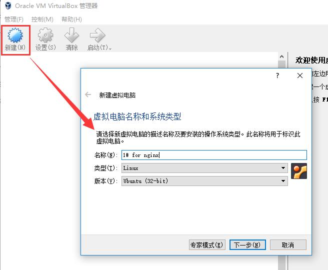

#### 2、分配内存

点击下一步，分配内存。注意尽量不要超过3GB，理由是如果超过3GB，可能会触发一个错误（解决方案参考这个链接：https://stackoverflow.com/questions/33304393/vt-x-is-disabled-in-the-bios-for-both-all-cpu-modes-verr-vmx-msr-all-vmx-disabl）

我选择分配2048MB（即2GB内存）。

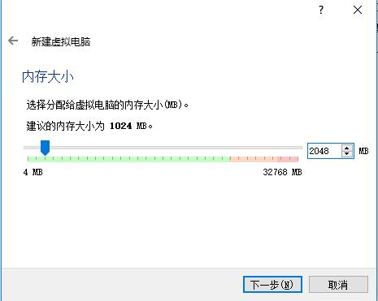

#### 3、虚拟硬盘

分配虚拟硬盘，推荐10GB。

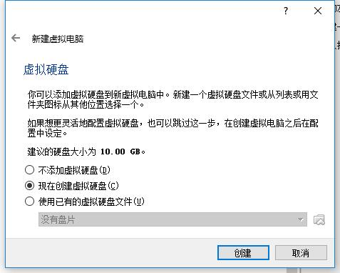

使用默认选项，点击创建按钮后，出现一个新弹窗。

在新弹窗里，前2步直接点击下一步，第三步选择位置的时候，建议改一下位置（默认是在C盘），并且我将大小调整到15GB，点击创建按钮。

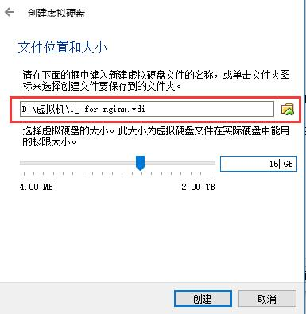

#### 4、启动

此时创建完毕，如下图，双击启动。

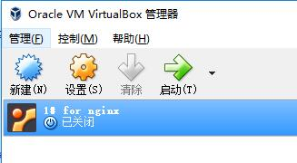

但是初始情况下如下图，原因是你没有安装操作系统。这个时候我们去下载 Ubuntu 系统。

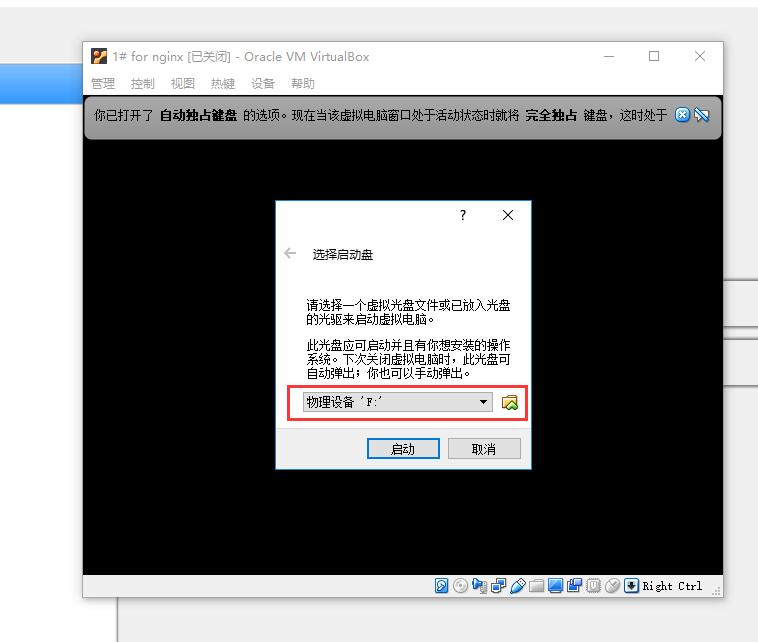

## 4、下载Ubuntu系统

打开这个网站：https://www.ubuntu.com/download/server ，然后下载LTS版本。

用虚拟机软件挂载下载的 ISO 文件，挂到某个光盘符下，然后虚拟机的启动盘也修改为同一个。

## 5、启动失败常见问题解决方案

如下图修改：

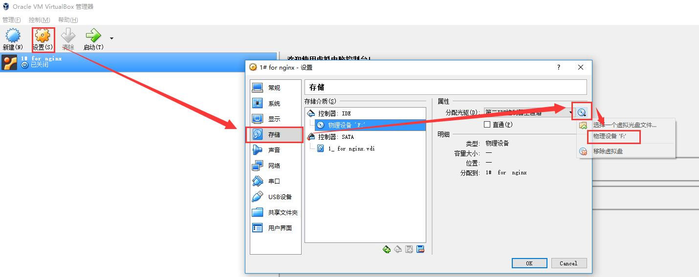

不然会报错误 ``No bootable medium found``

如果运行的时候提示：``this kernel requires an x86-64 cpu``，说明没有启用 ``intel Virtualization Technology``，解决方案参考：https://blog.csdn.net/zhouyongku/article/details/45172897

同时，系统需要选择 64bit 的，如下图：

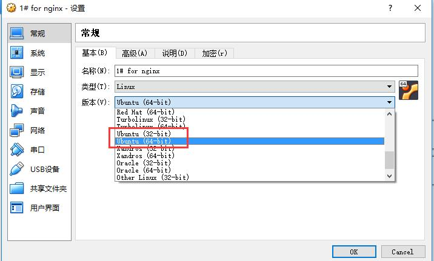

正常情况下，会自动触发安装，如下图

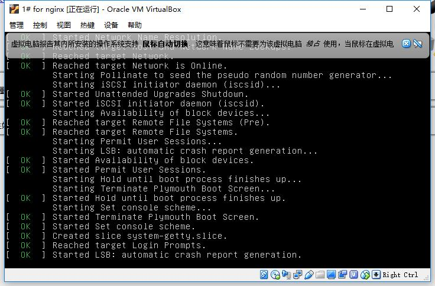

## 6、安装过程中的配置

第一步，选English，如图，接下来一路下一步，直到需要名字为止。

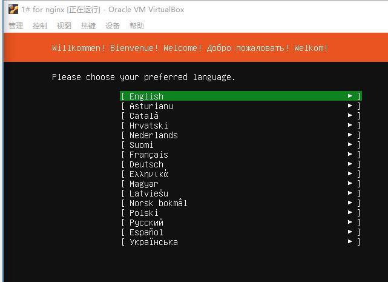

如图，输入名字，然后继续使用默认选项，一路下一步。

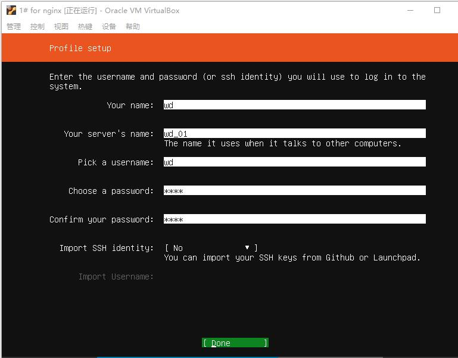

安装完成后如下图，点击 ``Reboot Now`` 启动。

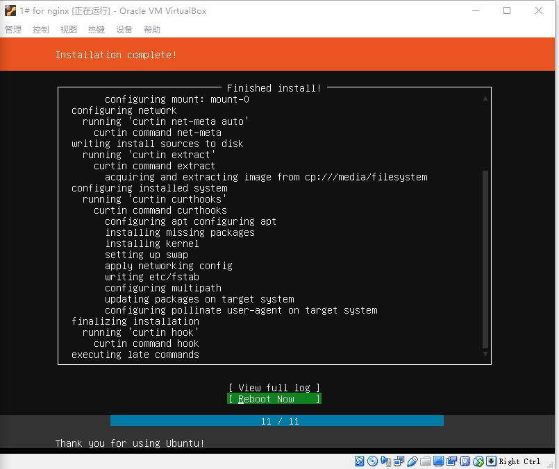

重启后，会提示你移除虚拟盘片，如下图，移除后继续。

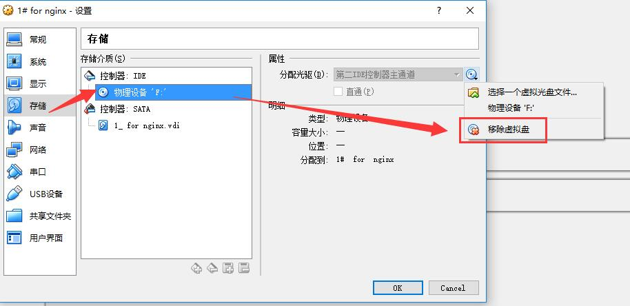

## 7、进入系统

在第七步，启动系统后，会刷出几个[OK]，但是没有输入内容的地方。这个时候，要按一下回车键，系统就会提示你输入姓名和密码了。

输入后，进入系统，如图：

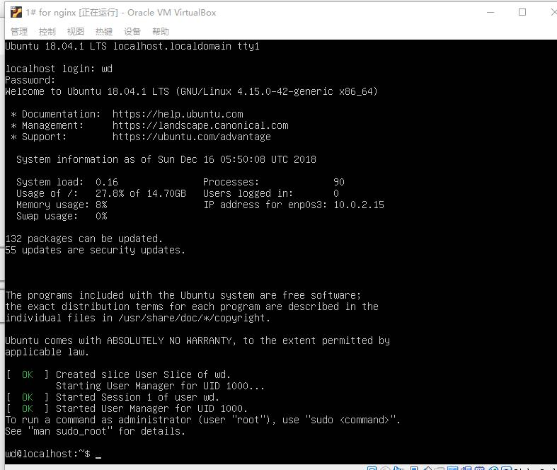
