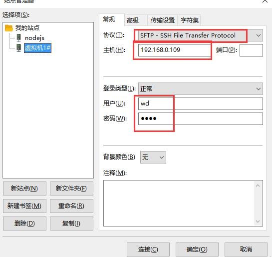
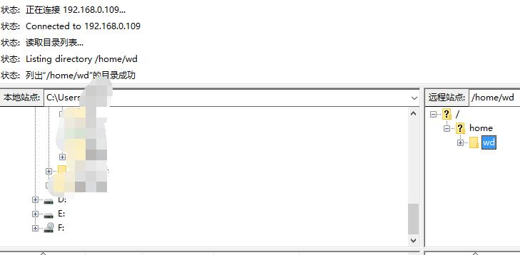

<p style='color:red;font-weight:bold;'>程序员技术交流、面试、职场、生活、游戏、相亲，综合讨论QQ群：387017550，群内经常发红包，欢迎加入</p>

<p style='color:red;font-weight:bold;'>群福利：每周一次免费面试，在YY频道直播，可旁听，有往期录音</p>

## 1、下载

虚拟机软件使用Oracle VM VirtualBox，优势是开源。

进入以下链接，然后下载：

https://www.oracle.com/technetwork/cn/server-storage/virtualbox/downloads/index.html

## 2、安装

打开，安装就行，建议不要放在C盘

## 3、新建虚拟机

#### 1、新建

首先打开 VirtualBox，点击新建，填写虚拟机名字，如下图：


#### 2、分配内存

点击下一步，分配内存。注意尽量不要超过3GB，理由是如果超过3GB，可能会触发一个错误（解决方案参考这个链接：https://stackoverflow.com/questions/33304393/vt-x-is-disabled-in-the-bios-for-both-all-cpu-modes-verr-vmx-msr-all-vmx-disabl）


我选择分配2048MB（即2GB内存）。


#### 3、虚拟硬盘

分配虚拟硬盘，推荐10GB。


使用默认选项，点击创建按钮后，出现一个新弹窗。

在新弹窗里，前2步直接点击下一步，第三步选择位置的时候，建议改一下位置（默认是在C盘），并且我将大小调整到15GB，点击创建按钮。


#### 4、启动

此时创建完毕，如下图，双击启动。


但是初始情况下如下图，原因是你没有安装操作系统。这个时候我们去下载 Ubuntu 系统。


## 4、下载Ubuntu系统

打开这个网站：https://www.ubuntu.com/download/server ，然后下载LTS版本。

用虚拟机软件挂载下载的 ISO 文件，挂到某个光盘符下，然后虚拟机的启动盘也修改为同一个。

## 5、启动失败常见问题解决方案

如下图修改：


不然会报错误 ``No bootable medium found``

如果运行的时候提示：``this kernel requires an x86-64 cpu``，说明没有启用 ``intel Virtualization Technology``，解决方案参考：https://blog.csdn.net/zhouyongku/article/details/45172897

同时，系统需要选择 64bit 的，如下图：


正常情况下，会自动触发安装，如下图


## 6、安装过程中的配置

第一步，选English，如图，接下来一路下一步，直到需要名字为止。


如图，输入名字，然后继续使用默认选项，一路下一步。


安装完成后如下图，点击 ``Reboot Now`` 启动。


重启后，会提示你移除虚拟盘片，如下图，移除后继续。


## 7、进入系统

在第七步，启动系统后，会刷出几个[OK]，但是没有输入内容的地方。这个时候，要按一下回车键，系统就会提示你输入姓名和密码了。

输入后，进入系统，如图：


## 8、设置虚拟机网络模式

有三种网络模式，桥接、NAT、Host-Only。

详解见：https://www.cnblogs.com/ggjucheng/archive/2012/08/19/2646007.html

我们这里使用桥接模式，像之前那样打开虚拟机的设置功能，如下图设置：


## 9、让Linux可以通过ftp来访问

参考文章：https://blog.csdn.net/timothy93bp/article/details/77527531

#### 1、下载 vsftpd

输入命令：

```
sudo apt-get install vsftpd
```

如果报错 ``could not get lock /var/lib/dpkg/lock`` ，参考这个链接；https://itsfoss.com/could-not-get-lock-error/

具体来说，先输入 ``ps aux | grep -i apt`` 搜索哪些占用了 apt，然后通过 ``sudo kill -9 进程id`` 的方式干掉他。

安装的过程中，他会提示你会占用一些空间，升级一些东西和安装一些东西。输入 ``Y`` 然后回车确认即可。

一会就安好了。

#### 2、配置 ftp 的密码

输入 ``sudo passwd ftp`` ，然后重复输入2次密码即可（账号名为你的默认账号名）。

#### 3、修改配置文件

输入 ``sudo vim /etc/vsftpd.conf`` 编辑配置文件。按下 ``i`` 进入编辑模式。

这个文件的详细配置说明参考：https://blog.csdn.net/mengtianwxs/article/details/72997092

1. ``listen=NO``改为　``listen=YES``；
2. 删除 ``write_enable=YES`` 之前的 ``#`` 井号（即注释符号，下同）；
3. 再取消如下配置前的注释符号：  
```
chroot_local_user=YES（是否将所有用户限制在主目录） 
chroot_list_enable=YES（是否启动限制用户的名单） 
chroot_list_file=/etc/vsftpd.chroot_list（可在文件中设置多个账号）
```
4. 按 esc 返回命令模式，再输入 ``:wq`` ，保存退出；

输入 ``sudo service vsftpd restart`` 重启 ftp 服务器

#### 4、安装 ssh

参考文章：https://blog.csdn.net/netwalk/article/details/12952051

首先，Ubuntu缺省没有安装SSH Server，使用以下命令安装：

```
sudo apt-get install openssh-server
```

然后输入 ``ps -e|grep ssh`` 确认 ssh 是否启动，如果显示 ``sshd`` 则表明已经启动了。

没启动的话，输入：``sudo /etc/init.d/ssh start`` 启动；或者 ``sudo /etc/init.d/ssh restart`` 重新启动；

#### 5、登录

windows客户端可以下载 FileZilla Client 来进行FTP登录。

如下图：

* 协议选 SFTP；
* 主机输入虚拟机的 IP（查询 ip 通过输入 ``ifconfig`` 命令，找 ``inet`` 后面的那个ip地址）；
* 端口不填（默认是22）；
* 输入用户名和密码；

点击【连接】即可。



常见问题：

1. 登录被拒绝怎么办？
    1. 查看是否没有安装 ssh；
    2. ssh服务是否没启动；
    3. ``/etc/vsftpd.conf`` 是否按我所说的进行更改配置；
    4. 重启一下 ssh 服务（命令见上面）；
    5. 重启一下 ftp 服务器（命令见上面）；
    6. 重启虚拟机；
    7. 重启主机；
    8. ping 一下试试（在主机输入``ping 虚拟机的ip地址``），能否ping通（ping不同说明ip可能是错的）；
    9. 通过 ssh 登录一下试试（命令 ``ssh 用户名@ip地址``），登录不了可能是ssh服务没启动；
    10. 总之，以上都正常的话，分别重启虚拟机和主机；

登录成功的话，应该如下图：



